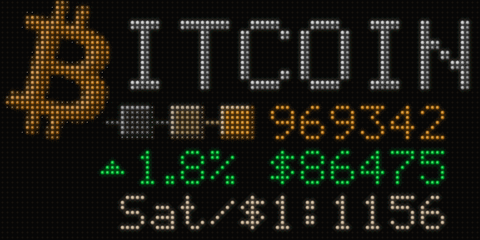
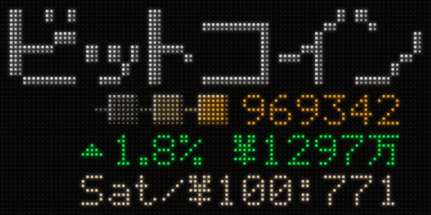

<p align="center">
  <picture>
    <source media="(prefers-color-scheme: dark)" srcset="docs/images/blockgrid-wordmark-dark.svg">
    
  </picture>
</p>

<h3 align="center">A desk-size Bitcoin dashboard built on a HUB75 LED matrix and an ESP32</h3>

<br>

<p align="center">
  
</p>

<p align="center">
  
  &nbsp;
  
</p>

<p align="center">
  BlockGrid shows the current block height, the price and its 24-hour change, and how many sats a dollar, euro or ¥100 buys.<br>
  Two optional buttons on the back adjust the brightness and switch between the different looks and currency pairs.<br>
  Everything else, from Wi-Fi to data sources, is set on a web page from your phone or computer.
</p>

<p align="center">
  <a href="https://n0cturnality.github.io/BlockGrid/"></a>
  &nbsp;
  <a href="#what-you-need"></a>
</p>

<br>

## Features

**Display**
- **Block height:** the chain tip, checked every 60 seconds.
- **Price:** in USD, EUR or JPY, with the 24-hour change and sats per $1, €1 or ¥100. Yen is shown in 万 (units of 10,000), the way large amounts are written in Japan.
- **Price effect:** roll, flash, sweep or none.
- **Two looks:** the Bitcoin logo, or ビットコイン in Japanese katakana.
- **Brightness:** 21 steps from 1 to 255, plus display off.
- **Flicker-free output:** double-buffered DMA drive of the HUB75 panel, at 6-bit colour per channel.

**Data sources**
- **Block height:** the mempool.space REST API, failing over to blockstream.info, or **your own node**: a mempool instance on a Start9, Umbrel or similar, over HTTP or HTTPS (self-signed certificates accepted), with the public APIs as fallback.
- **Price:** CoinGecko, failing over to mempool.space for the price and Coinbase for the 24-hour change. Polling interval adjustable from 30 seconds to 10 minutes (default 5).
- **Rate-limit handling:** after a 403 or 429 from CoinGecko it backs off for 10, then 30, then 60 minutes. When a source fails, the last good values stay on screen and are flagged as stale.

**Setup and control**
- **Captive-portal Wi-Fi setup:** BlockGrid starts its own password-protected access point. Joining it from a phone opens the setup page automatically, with a scan of nearby networks and their signal strength; hidden networks can be entered by name.
- **Web control page:** served at `http://blockgrid-xxxx.local` (mDNS) or the device's IP address. It covers brightness, display on/off, look, currency, price effect, data sources, polling interval, Wi-Fi and device status, and refreshes every 5 seconds from a JSON status endpoint, so changes made with the buttons show up on it.
- **Persistent settings:** stored in the ESP32's NVS flash, so they survive restarts and firmware updates.
- **Wi-Fi recovery:** reconnects with a back-off of 15 seconds rising to 60. After 3 minutes offline it falls back to the setup access point, retries the saved network every 2 minutes, and rejoins it automatically when it's back.
- **OTA updates:** firmware can be uploaded over Wi-Fi from the Arduino IDE (ArduinoOTA), protected by the device's setup password.

## What you need

<p align="center">
  
</p>

- a Waveshare flexible 96×48 LED matrix, 2.5 mm pitch (RGB-Matrix-P2.5-96x48-F), which comes with its ribbon and power cables
- an ESP32 DevKit V1 (30-pin) and a screw-terminal breakout board for it
- a 5 V, 2 A (or more) power supply and a panel-mount barrel jack
- a short USB-C extension cable, so you can reach the ESP32 from the back
- the 3D-printed enclosure, in a version with or without buttons, plus M3 screws, heat-set inserts and 10 × 2 mm magnets
- for the buttons version: two tactile buttons on a small prototype board
- recommended: two capacitors and a Schottky diode, to keep the power clean and protect your computer's USB port

<div align="center">

[](hardware/README.md)

<sub>Full parts list · wiring diagrams · button board layout · power and Wi-Fi tips · enclosure files · assembly photos</sub>

</div>

## Installing

### 1. Add the ESP32 boards to the Arduino IDE

1. Open **File → Preferences** (Windows and Linux) or **Arduino IDE → Settings** (macOS).
2. Under **Additional boards manager URLs**, paste this address. If the box already has one, add a comma first.

   ```
   https://espressif.github.io/arduino-esp32/package_esp32_index.json
   ```

3. Open **Tools → Board → Boards Manager…** (or the board icon in the left sidebar).
4. Search for **esp32** and install **esp32 by Espressif Systems**, version **3.3.12**. Not "Arduino ESP32 Boards", which is a different package. It's a large download.
5. Choose **Tools → Board → esp32 → ESP32 Dev Module**, or the entry for your board.
6. Plug the ESP32 in by USB and select its port under **Tools → Port**. No new port? The board's USB chip needs a driver. Most use a CP210x or CH340 chip (the name is printed next to the USB socket), and the driver is a free download from the chip maker.

### 2. Install the libraries

Open **Tools → Manage Libraries…** and install:

| Search for | Author | Version |
|---|---|---|
| ESP32 HUB75 LED MATRIX PANEL DMA Display | mrcodetastic | 3.0.15 |
| Adafruit GFX Library | Adafruit | 1.12.6 |
| Adafruit BusIO | Adafruit | 1.17.4 (offered with Adafruit GFX: choose "Install all") |
| ArduinoJson | Benoit Blanchon | 7.x |

Everything else (Wi-Fi, the web server, HTTPS, OTA) comes with the ESP32 board package. You don't need ESPAsyncWebServer or AsyncTCP.

### 3. Open the sketch and upload it

1. Download this repository (**Code → Download ZIP**) and unzip it.
2. Open `firmware/BlockGrid/BlockGrid.ino`. Leave `build_opt.h` next to it: it sets the panel's colour depth, and the sketch won't compile without it.
3. **Restart the Arduino IDE once.** This rebuilds the panel library with that colour depth. Skip it and mixed colours come out wrong: orange turns pink.
4. Check two settings near the top of the sketch:
   - **`PANEL_VERSION`:** check the label on the back of the panel. Ends in `-24S-A2.1` or `-24S-V2.1`? Use `1`. Ends in `-24S-A1`? Use `2` (the default).
   - **`HAS_BUTTONS`:** `1` for the enclosure with buttons, `0` for the one without. The web page can do everything the buttons do.
5. Click **Upload**.

### 4. Connect it to your Wi-Fi

1. The panel shows **WiFi Setup**, a network called **BlockGrid**, and a password.
2. Join that network on your phone. The setup page should open by itself; if not, browse to `http://192.168.4.1`.
3. Choose your home network, enter its password and tap **Connect**. BlockGrid restarts and joins it.
4. Open the control page at `http://blockgrid-xxxx.local`. The exact name and IP address are printed in the serial monitor (115200 baud) and shown on the page itself.

Each BlockGrid has its own setup password, which also protects over-the-air updates.

## Using it

**Buttons** (if fitted):

| | Short press | Hold |
|---|---|---|
| Top | Brighter | Next theme |
| Bottom | Dimmer (at the lowest level: display off) | Next currency |
| Both, for 3 s | | Restart |

**The web control page** does everything the buttons do, and also lets you choose the price effect, data sources, update interval, your node's address and the Wi-Fi network. It has no password, so anyone on your Wi-Fi can use it.

**Using your own node:** under **Data sources → Block height**, choose **My node** and enter the mempool app's address, as you'd type it into a browser (for example `https://192.168.1.50:50194`). BlockGrid asks your node first and falls back to the public servers if it doesn't answer. Self-signed certificates work fine.

## The simulator

`docs/index.html` simulates the panel and the control page; it's the same page as the [live demo](https://n0cturnality.github.io/BlockGrid/). Open it in any browser, with nothing to install. Its drawing code is a line-for-line copy of the sketch's, and the main screens are checked to match the sketch pixel for pixel. That makes it the place to try out a design change before touching the sketch.

## Repository layout

| Path | Contents |
|---|---|
| `firmware/BlockGrid/` | The Arduino sketch and `build_opt.h` |
| `docs/index.html` | The simulator (also the live demo, via GitHub Pages) |
| `docs/images/` | The GIFs and pictures on this page |
| `hardware/` | Parts list, wiring, button board layout and assembly |
| `hardware/enclosure/` | The enclosure files (STL and STEP), with and without buttons |
| `hardware/photos/` | Assembly photos |

## Credits

- [ESP32-HUB75-MatrixPanel-DMA](https://github.com/mrcodetastic/ESP32-HUB75-MatrixPanel-DMA) by mrcodetastic drives the panel.
- [Adafruit GFX](https://github.com/adafruit/Adafruit-GFX-Library) draws the text and graphics.
- [ArduinoJson](https://arduinojson.org/) by Benoit Blanchon reads the price data.
- The katakana wordmark and the 万 symbol are built from the [Misaki font](https://littlelimit.net/misaki.htm) bitmaps by Num Kadoma.
- Data comes from [mempool.space](https://mempool.space), [blockstream.info](https://blockstream.info), [CoinGecko](https://www.coingecko.com) and [Coinbase](https://www.coinbase.com). BlockGrid isn't affiliated with any of them.

## License

[MIT](LICENSE)

