# BlockGrid hardware

  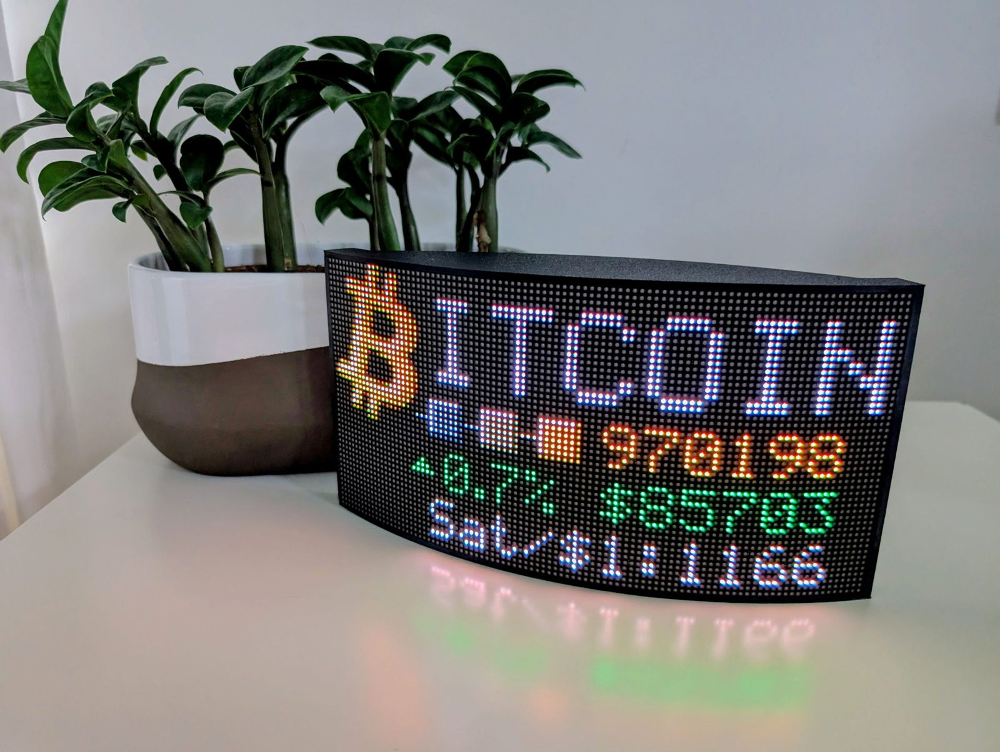

The panel is flexible and curves around the 3D-printed case, held on by magnets. Inside, the ESP32 plugs into a screw-terminal breakout board, so nothing is soldered to the ESP32 itself. The power jack, a USB-C port for uploads and (optionally) two buttons are on the back.

The enclosure comes in two versions, [with and without buttons](#enclosure). Everything below applies to both unless it says "buttons version".

## Parts list

| Qty | Part | Notes |
|---|---|---|
| 1 | Waveshare flexible RGB LED matrix, 96×48, 2.5 mm pitch (RGB-Matrix-P2.5-96x48-F) | 4608 RGB LEDs, HUB75. The ribbon cable and power cable come with it. Two hardware versions exist; see [Panel version](#panel-version). |
| 1 | ESP32 DevKit V1 (ESP-WROOM-32), 30-pin | It has to be the 30-pin layout to fit the breakout board. Recent ones have a USB-C socket. |
| 1 | Screw-terminal breakout board for the 30-pin ESP32 DevKit V1 | The ESP32 plugs into it and every wire goes into a screw terminal. |
| 1 | 5 V power supply, 2 A minimum, with a barrel plug | Centre positive. Its plug must fit the jack below. |
| 1 | Barrel jack socket, 2.5 mm centre pin, panel mount with fixing nut | Fits the hole marked 5V on the back of the case. |
| 1 | Short USB-C extension cable, male to female | Brings the ESP32's USB port to the back of the case, for uploads and the serial monitor. Its socket end is glued in place; see [Assembly](#assembly). |
| 7 to 16 | 10 × 2 mm neodymium disc magnets, N52 recommended | Glued into the pockets around the rim of the case; they hold the panel. More magnets, firmer hold. |
| 8 | M3 × 6 mm countersunk (flat head) hex socket screws | 4 for the breakout board, 2 through the bottom of the base at each end to hold the case together, and 2 for the button board (buttons version). |
| 1 | M3 × 40 mm hex socket head cap screw | Holds the top and base together through the centre of the base, with two M3 × 6 screws at the ends. |
| 9 | M3 heat-set threaded inserts, 4 mm long, 5 mm outside diameter | All nine are melted into the printed case with a soldering iron. |
| 1 set | 3D-printed enclosure | With or without buttons; see [Enclosure](#enclosure). |
| | **Buttons version only** | |
| 2 | 6 × 6 mm tactile push buttons with a long round actuator | Long enough to reach through the back of the case. |
| 1 | Double-sided prototype board, 1.2" × 1.2" (30 × 30 mm), 8 × 11 holes | Holds the buttons; see [Button board](#button-board-buttons-version). |
| | 28 AWG wire in three colours | From the buttons to the breakout board. Yellow, blue and black in the photos. |
| | **Recommended** | |
| 1 | 1000 µF electrolytic capacitor, 10 V or higher | Across the panel's 5 V supply; see [Power](#power). |
| 1 | 100 µF electrolytic capacitor, 10 V or higher | Across the ESP32's VIN and GND; see [Power](#power). |
| 1 | 1N5819 Schottky diode (1 A, 40 V) | Between the supply and the ESP32's VIN; see [Power](#power). |

**Tools and supplies:** a soldering iron and solder (also used to set the inserts), heat-shrink tubing, glue for the magnets and the USB-C socket, a 2 mm and a 2.5 mm hex key, wire strippers, a small screwdriver for the terminals, and a multimeter for checking.

  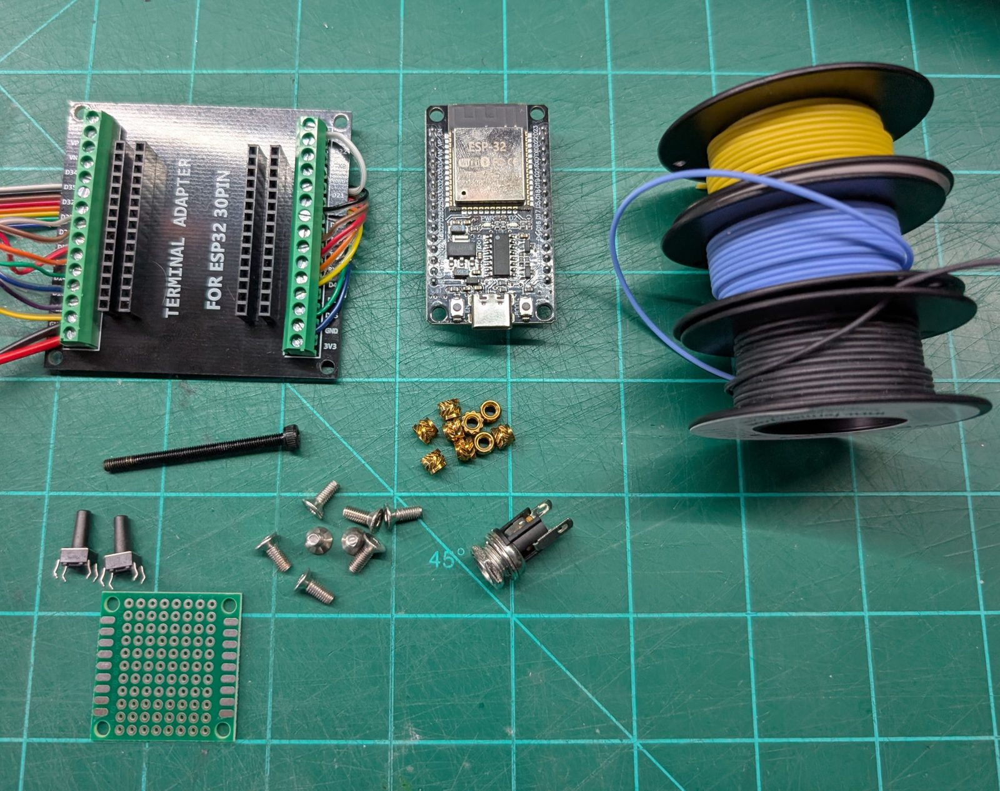

## Wiring

### Panel (HUB75)

The panel's ribbon cable plugs into its HUB75 **input** connector (the arrows on the back of the panel point away from it). At the other end, each wire has its own small pin plug. Cut the pin plugs off, strip a few millimetres from each wire, tin the bare end with a little solder so the strands hold together, and screw each one into the breakout board.

  

Count the wires from the edge that goes to pin 1 of the plug, the one next to **R1** on the panel. On the rainbow cable that comes with the panel, wire 1 is **brown** and the colours run brown, red, orange, yellow, green, blue, purple, grey, white, black, then start again at brown. Cables vary, so check yours: if in doubt, test each wire against the pin labels printed next to the panel's connector, using a multimeter's continuity setting.

| Ribbon wire | Colour | HUB75 signal | ESP32 GPIO | Breakout terminal |
|---|---|---|---|---|
| 1 | brown | R1 | 25 | D25 |
| 2 | red | G1 | 26 | D26 |
| 3 | orange | B1 | 27 | D27 |
| 4 | yellow | GND | GND | GND |
| 5 | green | R2 | 14 | D14 |
| 6 | blue | G2 | 12 | D12 |
| 7 | purple | B2 | 13 | D13 |
| 8 | grey | E | 33 | D33 |
| 9 | white | A | 23 | D23 |
| 10 | black | B | 19 | D19 |
| 11 | brown | C | 5 | D5 |
| 12 | red | D | 17 | **TX2** |
| 13 | orange | CLK | 16 | **RX2** |
| 14 | yellow | LAT | 4 | D4 |
| 15 | green | OE | 15 | D15 |
| 16 | blue | GND | GND | GND |

GPIO 16 and 17 are labelled **RX2** and **TX2** on most breakout boards, not D16 and D17. Both ground wires (4 and 16) go to a GND terminal, one on each side of the board; each GND terminal also takes a second wire, from the power cable on one side and the buttons on the other.

The pins are set at the top of the sketch (`R1_PIN_DEFAULT` and so on) if your wiring differs.

### Power

The panel's power cable has a plug for the panel and two red and two black leads.

  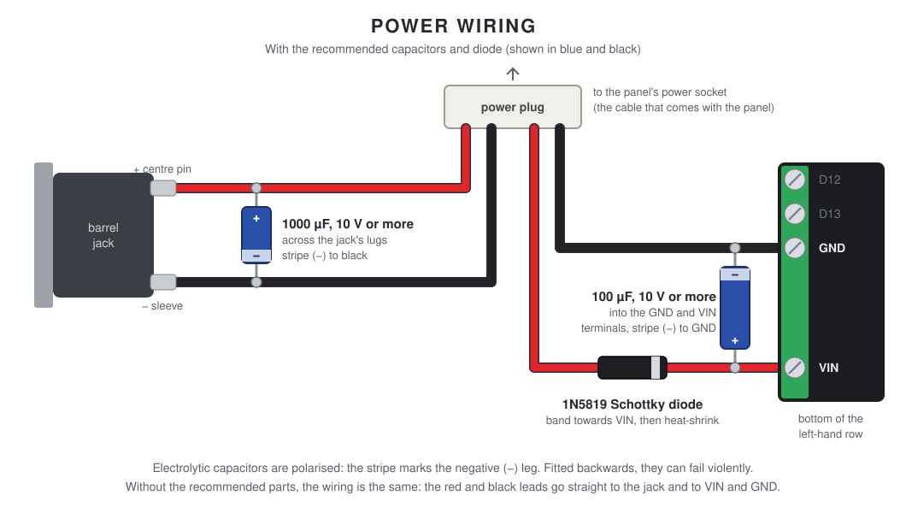

- **One red and black pair goes to the barrel jack:** red to the centre pin, black to the outer sleeve. Solder them and cover each joint with heat-shrink.
- **The other pair goes to the breakout board:** red to **VIN**, black to **GND**, the bottom two terminals of the left-hand row. This powers the ESP32 from the same supply.
- **The recommended parts**, if you fit them:
  - **1000 µF capacitor:** solder its legs to the jack's two lugs along with the wires, stripe (−) to the sleeve lug.
  - **1N5819 diode:** solder it into the red lead to VIN, close to the breakout board, with its band towards VIN. Cover it with heat-shrink.
  - **100 µF capacitor:** put its legs into the GND and VIN terminals together with the wires, stripe (−) to GND.

[Power](#power) explains why each one helps.

### Buttons (buttons version)

| Wire | Breakout terminal | Does |
|---|---|---|
| Yellow, from the top button | D32 (GPIO 32) | Brighter / next theme |
| Blue, from the bottom button | D18 (GPIO 18) | Dimmer / next currency |
| Black, from both buttons | GND | |

No resistors are needed: the ESP32's internal pull-ups are used.

## Button board (buttons version)

Both buttons sit on one small prototype board, which screws to the inside of the back panel with its buttons poking out through the case.

  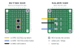

Columns and rows are counted from the **button side**, with column 1 on the left and row 1 at the top. On the solder side everything is mirrored, so column 1 is on the right.

1. **Fit the buttons on the button side.** The top button's legs go in columns 4 and 6, rows 5 and 7; the bottom button's in columns 4 and 6, rows 8 and 10. Keep the top-right and bottom-left corner holes clear: those are the screw holes.
2. **Solder all eight legs** on the solder side.
3. **Add the wires** in the next column out (column 7), each bridged with solder to the leg beside it:
   - **yellow** in row 5, to the top button's leg in row 5
   - **black** in row 7, bridged to the legs in rows 7 **and** 8, so one wire grounds both buttons
   - **blue** in row 10, to the bottom button's leg in row 10
4. **Check it with a multimeter.** Yellow to black should only connect while the top button is pressed, and blue to black only while the bottom button is pressed. If a pair connects all the time, that button is turned 90°: rotate it.

<table>
  <tr>
    <td width="33%">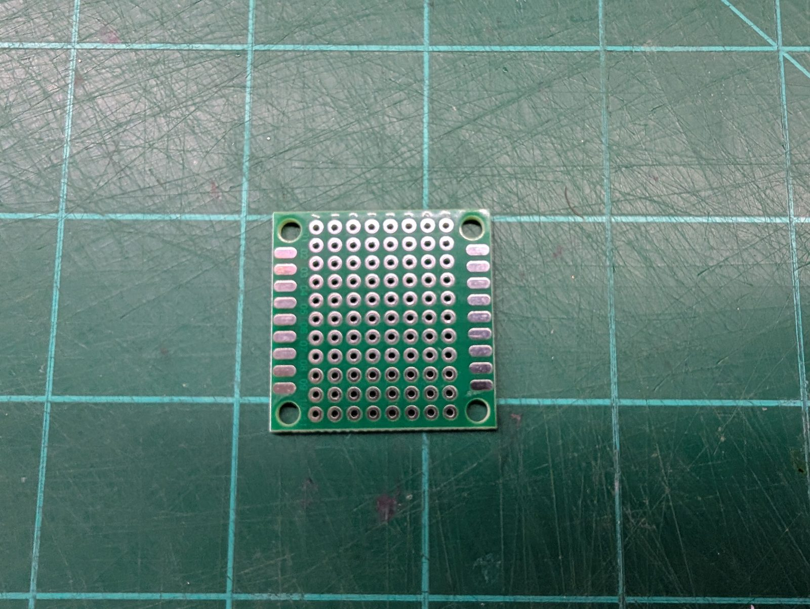</td>
    <td width="33%">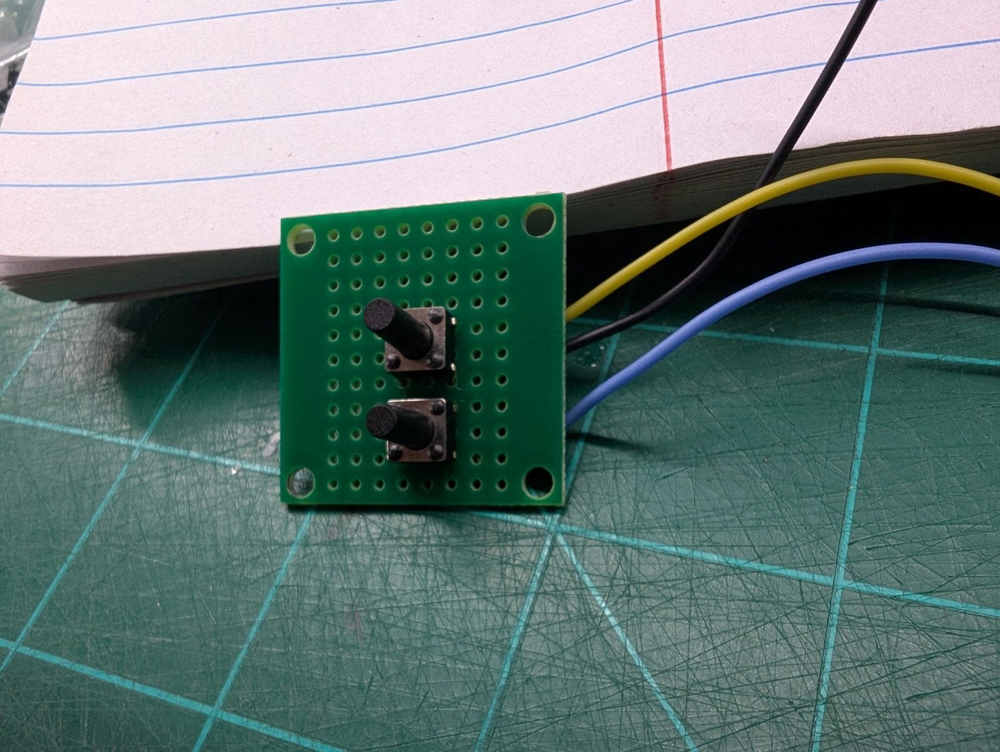</td>
    <td width="33%">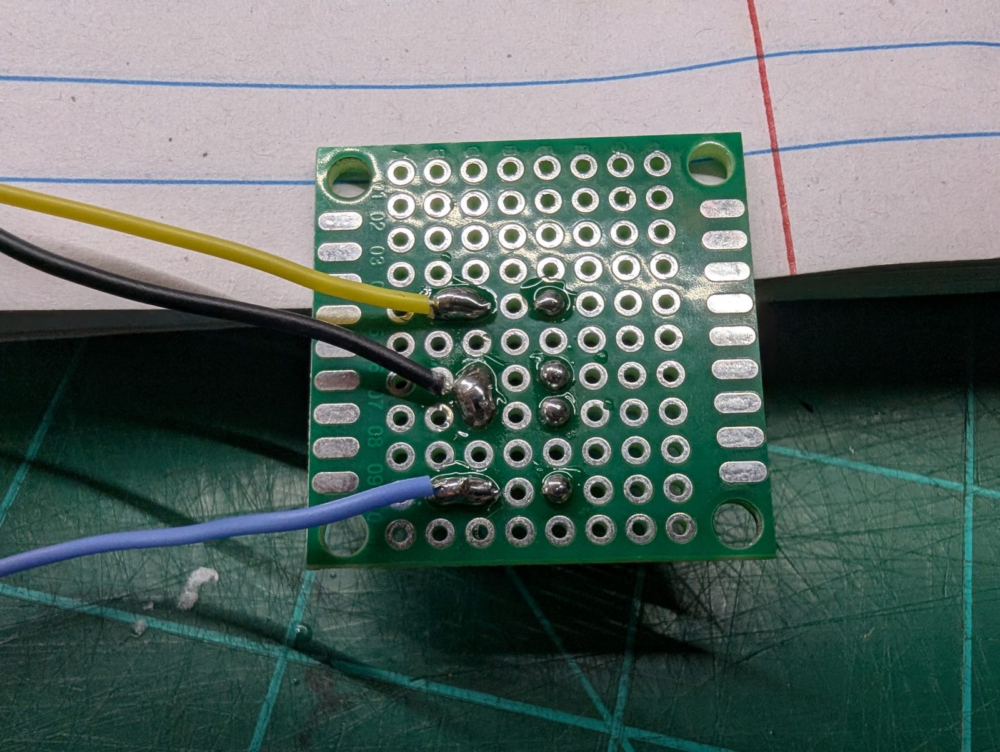</td>
  </tr>
  <tr>
    <td align="center">The bare board</td>
    <td align="center">Button side</td>
    <td align="center">Solder side</td>
  </tr>
</table>

## Panel version

Waveshare sells two versions of this panel. The label on the back tells them apart:

| Label ends in | `PANEL_VERSION` | Difference |
|---|---|---|
| `-24S-A2.1` or `-24S-V2.1` | `1` | The original panel. Some are printed V2.1, but they are still version 1. |
| `-24S-A1` | `2` (default) | SM5368 row drivers, red and blue swapped. The sketch handles both; the wiring is the same. |

## Power

- **The panel and the ESP32 share one 5 V supply:** the panel through its power cable, the ESP32 through the breakout board's VIN terminal.
- **The grounds must be connected:** the ESP32's GND and the panel's GND, both through the power cable and through the ribbon cable's ground wires.
- **BlockGrid draws about 0.4 A at full brightness,** Wi-Fi included, so a 2 A supply has plenty of headroom. Every LED at full white draws about 2.5 A, but BlockGrid never shows that. See [Measured current](#measured-current).
- **Restarting on its own** usually means the 5 V supply is dipping. The serial log's first line after a restart says "brownout" when that's the cause.

### Measured current

| Screen | Brightness | Current at 5 V |
|---|---|---|
| Every LED full white (a test, not something BlockGrid shows) | 255 | about 2.5 A |
| BlockGrid, normal use, Wi-Fi included | 255 (maximum) | about 0.4 A |

BlockGrid draws so much less because most of its screen is black and its text is a thin pixel font. At its default brightness of 60 it draws less still.

### Two capacitors (recommended)

The panel doesn't draw a steady current. Its LEDs are switched on and off thousands of times a second, so the current comes in sharp spikes. The ESP32 adds spikes of its own: each Wi-Fi transmission briefly draws several hundred milliamps. On thin or long power wires those spikes become dips and ripple in the 5 V supply, which can restart the ESP32 (a brownout) or disturb its Wi-Fi.

Two capacitors smooth this out by supplying the spikes from close by:

- **1000 µF across the barrel jack's lugs.** It covers the LEDs' current spikes, so they don't pull the supply down for everything else.
- **100 µF across the breakout board's VIN and GND terminals.** It covers the Wi-Fi bursts, so the ESP32 never sees its own supply sag.

Use electrolytic capacitors rated **10 V or more**. They're polarised: the stripe marks the **negative (−) leg**, which goes to GND. Fitted the wrong way round, they can fail violently.

### A Schottky diode (recommended)

The ESP32 is powered from the 5 V supply through VIN. Plugging in a USB cable (to upload or to watch the serial monitor) connects a second 5 V source: your computer's USB port. The two can then feed each other. The supply can push current back into the computer's USB port, and if the supply is off, the computer tries to power the whole panel through the USB cable, far beyond what a USB port is made for.

A diode in the supply line to the ESP32 lets current flow only one way: from the supply into the ESP32, never back.

- **Fit a 1N5819** (or similar) in the red lead to the VIN terminal. The **stripe (cathode) faces the ESP32**.
- **Why Schottky:** a Schottky diode loses only about 0.3 V, against roughly 0.7 V for an ordinary diode. That keeps VIN near 4.7 V, comfortably above what the ESP32's 3.3 V regulator needs.
- **It only carries the ESP32's current,** well under 1 A, so a 1 A diode is plenty. The panel stays connected straight to the supply.

Many ESP32 DevKit boards already have a diode between the USB socket and VIN, but not all do, and it's hard to tell from the outside. The external diode covers both cases. With it in place, you can leave USB plugged in while the supply is on.

## Wi-Fi interference

The panel is electrically noisy. Its data lines switch millions of times a second, the ribbon cable acts like a small antenna, and the LED current spikes travel down the power wires. Close to the ESP32's antenna, that noise can drown out the 2.4 GHz Wi-Fi signal.

**Signs:** a weak Wi-Fi signal on the control page's Device card, dropouts, a slow control page, or price and block updates failing now and then.

**What helps:**

- **Keep the ESP32's antenna clear.** The antenna is the end of the module with the zig-zag copper trace, opposite the USB socket. Keep it away from the ribbon wires, the power wires and metal (screws, inserts, magnets).
- **Keep the ribbon wires short** and route them away from the antenna.
- **Fit the two capacitors** described under [Power](#power). Less noise on the 5 V line means less of it reaches the ESP32's radio.
- **Check the signal** on the control page's Device card: −70 dBm or stronger (closer to zero) is comfortable. If it's weaker, try moving BlockGrid closer to your router.

The firmware helps too: it drives the panel at the library's default 8 MHz rather than faster, and keeps Wi-Fi power saving off, so the connection stays responsive.

## Enclosure

  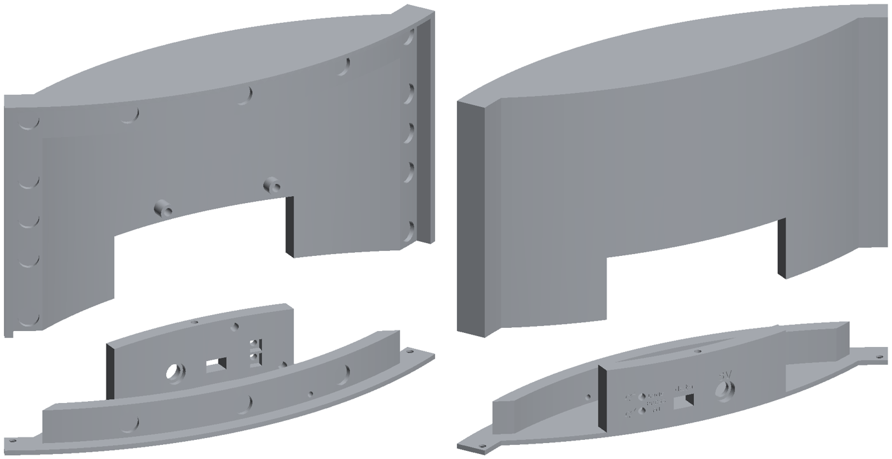

The case is two printed parts: the **top**, the curved shell the panel sits on, and the **base**, which closes the bottom and carries the back panel. The pockets around the front rim hold the magnets. Three screws through the bottom of the base hold the two together: an M3 × 40 in the centre and an M3 × 6 at each end.

Print the top and **one** of the two bases:

| Part | Files | Sketch setting |
|---|---|---|
| Top | `HUB75_enclosure_top.stl` | |
| Base with buttons | `HUB75_enclosure_base.stl` | `HAS_BUTTONS 1` |
| Base without buttons | `HUB75_enclosure_base_no_buttons.stl` | `HAS_BUTTONS 0` |

The files are in [`enclosure/`](enclosure/). Each part also comes as a `.step` file, for editing in Fusion or any other CAD program.

### Print settings

| Setting | Value |
|---|---|
| Material | PLA+ |
| Layer height | 0.2 mm |
| Walls | 3 |
| Infill | 20% |
| Supports | Yes, tree supports (the slicer's default) |
| Brim | Mouse ears |

Print each part the way round shown in the picture: the top standing on its edge, the base lying flat. The parts are about 241 mm long, so they need a large bed; on a smaller one, print them one at a time, diagonally if needed.

  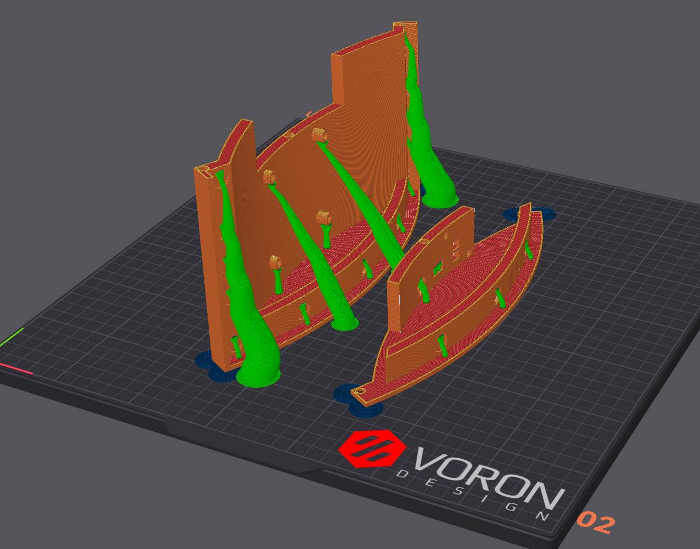

The base without buttons doesn't need the buttons, the prototype board, the 28 AWG wire or the button board's two screws. The web control page does everything the buttons do.

## Assembly

1. **Print the enclosure** and melt the heat-set inserts into their holes with a soldering iron.
2. **Glue the magnets** into the pockets around the rim. If the round pads on the back of your panel are magnets too, check that each magnet attracts the panel at that spot before you glue it, rather than pushing it away.
3. **Screw the breakout board** to the inside of the case with four M3 × 6 screws, and plug the ESP32 in with its USB socket towards the back opening.
4. **Fit the back panel parts:** the barrel jack through the hole marked 5V, held by its nut; the USB-C extension (see below); and (buttons version) the [button board](#button-board-buttons-version) with two M3 × 6 screws, buttons out.

   **The USB-C extension:** plug its male end into the ESP32, then line its female end (the socket) up with the opening marked "data", so the socket sits straight in the opening. Fix it with a little glue where the socket meets the inside of the case and the edges of the opening. This keeps it aligned and stops it being pushed back into the case when you plug a cable in. Use only a little, and keep glue out of the socket itself. Let it set before plugging anything in.

5. **Wire the power, the panel and the buttons** as described under [Wiring](#wiring).
6. **Upload the sketch and test it** before closing up, through the USB-C port on the back. See [Installing](../README.md#installing).
7. **Join the top and the base** from underneath: the M3 × 40 screw through the centre of the base, and an M3 × 6 screw at each end.
8. **Plug the ribbon cable and power cable into the panel,** then lay the panel onto the front of the case. The magnets hold it in place.

<table>
  <tr>
    <td width="50%">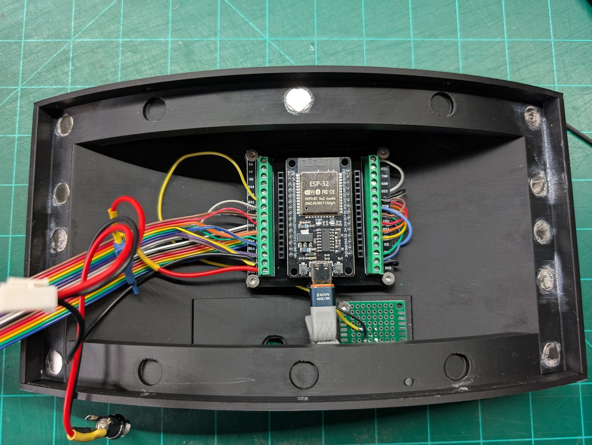</td>
    <td width="50%">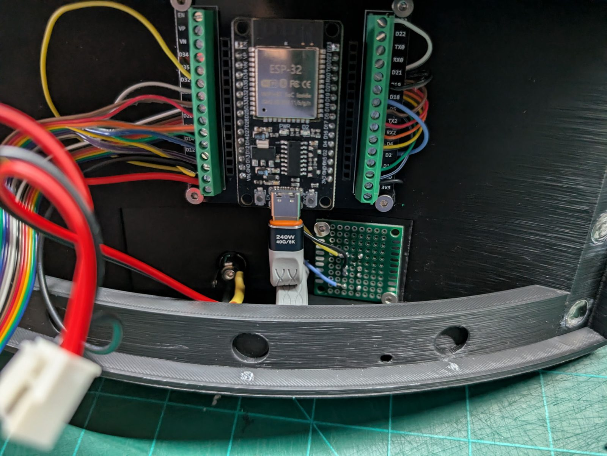</td>
  </tr>
  <tr>
    <td align="center">Electronics in place</td>
    <td align="center">USB-C extension, barrel jack and button board</td>
  </tr>
  <tr>
    <td width="50%">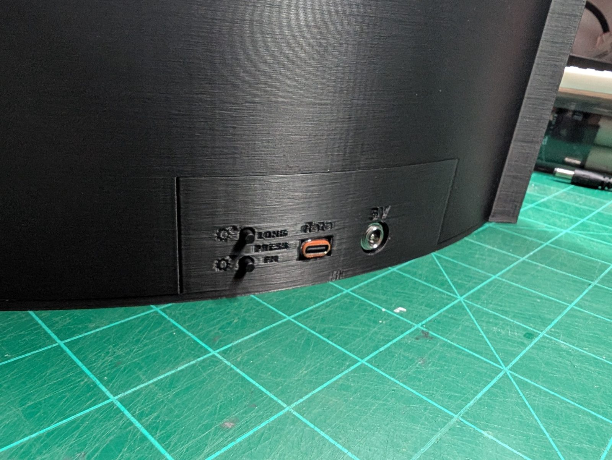</td>
    <td width="50%">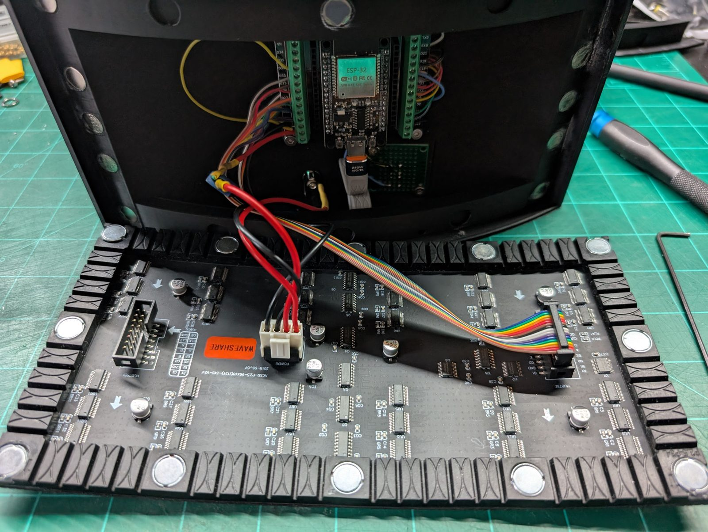</td>
  </tr>
  <tr>
    <td align="center">The back: buttons, USB-C and power</td>
    <td align="center">Panel connected, before fitting</td>
  </tr>
  <tr>
    <td width="50%">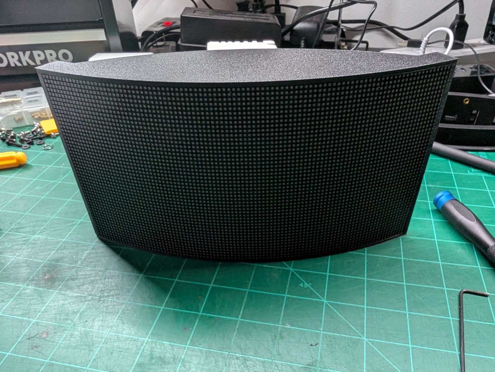</td>
    <td width="50%">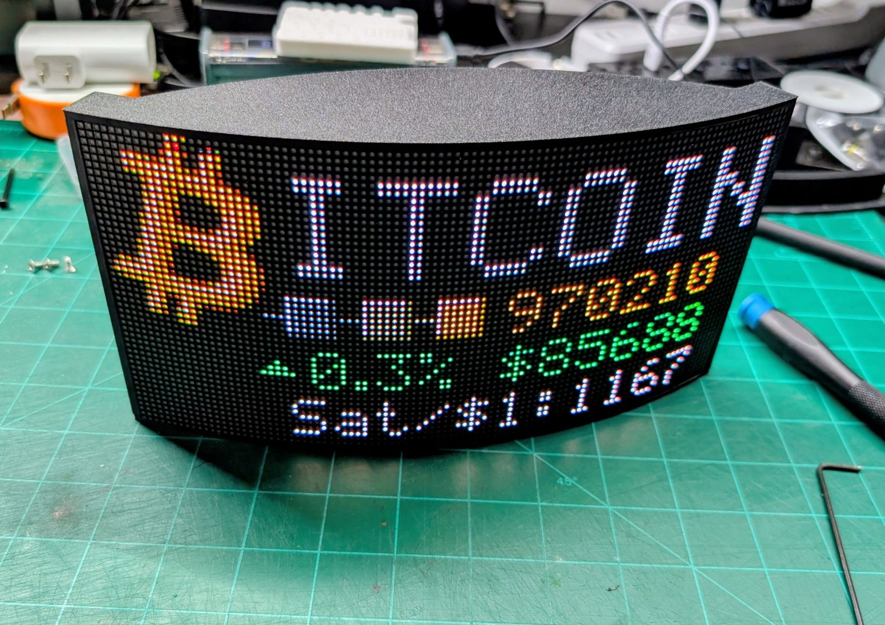</td>
  </tr>
  <tr>
    <td align="center">Panel fitted</td>
    <td align="center">Finished</td>
  </tr>
</table>

## Troubleshooting

| Symptom | Fix |
|---|---|
| Jumbled image, rows lit in the wrong places | Wrong `PANEL_VERSION` (see [Panel version](#panel-version)), or two ribbon wires swapped (see [Wiring](#panel-hub75)). |
| Red and blue swapped | Wrong `PANEL_VERSION`. |
| One colour missing, or the image torn into strips | A ribbon wire loose in its terminal or in the wrong one; see [Wiring](#panel-hub75). |
| Orange looks pink, tan looks mint | `build_opt.h` isn't in the sketch folder, or the Arduino IDE wasn't restarted after adding it. |
| Nothing on the panel, ESP32 runs | Check the 5 V feed to the panel and the shared ground. |
| Random restarts | Power supply too weak or a voltage drop in the wiring; fit the capacitors. See [Power](#power). |
| Weak Wi-Fi, dropouts, failed updates | Noise from the panel reaching the antenna; see [Wi-Fi interference](#wi-fi-interference). |
| A button does nothing, or acts as if held down | Check its wire and the GND wire; if it acts as if held, the button is turned 90°. See [Button board](#button-board-buttons-version). |
| No port in the Arduino IDE | Install the USB driver for the board's CP210x or CH340 chip, and check the USB-C extension supports data, not just charging. |
